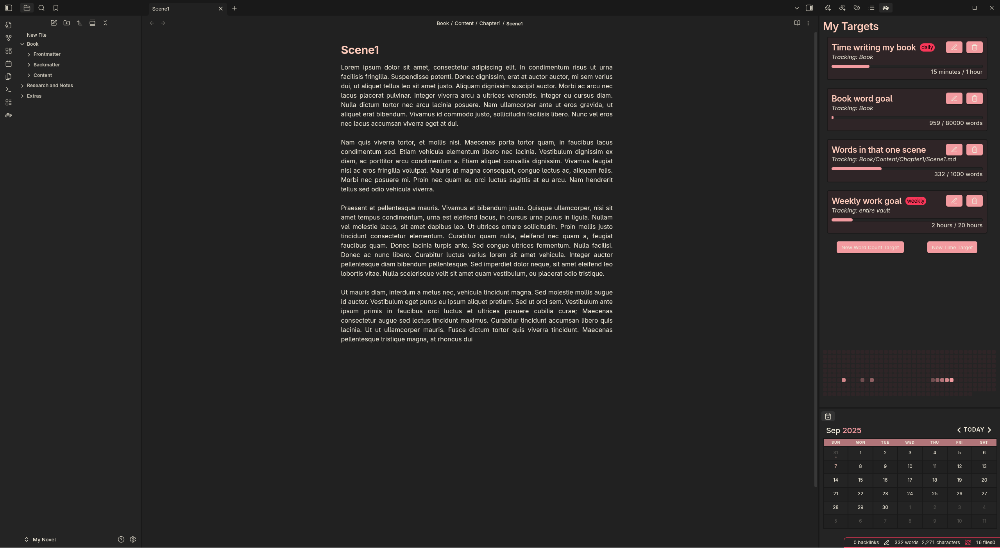

# Obsidian Targets
This plugin allows you to create and manage "targets" in Obsidian, which track your progress towards specific goals on files or folders. Your targets can be viewed and managed in the Target view, which can be opened from the left ribbon.

Targets can track word count or time spent on a file or folder. You can set the target to repeat daily, weekly, or not at all. When a target repeats, it will reset its progress at the start of the new period, which means word count tracks the number of new words added during that period.



## Installation
Getting the code:
```
git clone git@github.com:joey8angelo/obsidian-targets.git
cd obsidian-targets
```
Install and build the plugin:
```
npm install
npm run build
```

## Usage
To create a new target, open the target view with the command palette or with the button in the left ribbon. Then you can create a new word count or time spent target by clicking the corresponding button. You can then configure the target's settings, such as the name, file or folder to track, the goal amount, and whether it repeats. 

## Settings
You can configure the plugin's settings by opening the settings panel and navigating to the "Targets" tab.

`Daily Reset Hour`: The hour of the day when daily targets reset. The default is 12AM.

`Weekly Reset Day`: The day of the week when weekly targets reset. The default is Sunday.

`Max Idle Time (seconds)`: The maximum amount of time that can pass without editing a file before time tracking is paused. The default is 30 seconds.

`Include Comments in Word Count`: Whether comments should be included in the word count for targets. The default is false.
